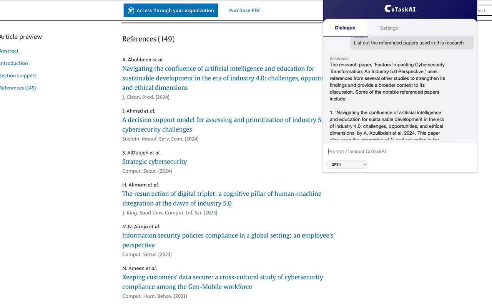

# CoTaskAI Chrome Extension

<div align="center">
  
  
  <p>LLM power directly in your browser — analyze, summarize, and generate ideas from web content.</p>

  <p></p>
  
  [](https://opensource.org/licenses/MIT)
  [](https://github.com/yourusername/cotaskai)
  [](CONTRIBUTING.md)
</div>

## 🌟 Features

- **Content Analysis**: Analyze any webpage or PDF document directly in your browser
- **Contextual Understanding**: AI understands the content you're viewing for relevant responses
- **Multiple AI Models**: Choose between OpenAI's models (GPT-3.5, GPT-4, GPT-4o, o1-mini, o3-mini), Gemini, xAI, DeepSeek, Anthropic, etc. coming soon...
- **Conversation Persistence**: Conversations are saved per page for future reference
- **Right-Click Integration**: Select text and ask CoTaskAI via context menu
- **PDF Support**: Built-in PDF processing capability

## 📋 Table of Contents

- [Installation](#-installation)
- [Usage](#-usage)
- [API Setup](#-api-setup)
- [Configuration](#-configuration)
- [Development](#-development)
- [Contributing](#-contributing)
- [License](#-license)

## 🚀 Installation

### Option 1: Chrome Web Store (Coming Soon)
1. Visit the Chrome Web Store
2. Search for "CoTaskAI"
3. Click "Add to Chrome"

### Option 2: Manual Installation
1. Download or clone this repository
   ```bash
   git clone https://github.com/yourusername/cotaskai.git
   ```
2. Open Chrome and navigate to `chrome://extensions/`
3. Enable "Developer mode" in the top-right corner
4. Click "Load unpacked" and select the `chrome-extension` directory

## 🔍 Usage

### Dialogue with Page Content
1. Navigate to any webpage or PDF document
2. Click the CoTaskAI icon in your browser toolbar
3. Type your question in the text field and press Enter
4. The AI will respond based on the content of the current page

### Context Menu
1. Select text on any webpage
2. Right-click and select "Ask CoTaskAI"
3. View the AI's analysis of the selected text

### PDF Analysis
1. Open any PDF in your browser
2. Click the CoTaskAI icon to analyze and ask questions about the document

## 🔑 API Setup

CoTaskAI requires API keys to function:

### OpenAI API Key
1. Create an account at [OpenAI](https://platform.openai.com/)
2. Generate an API key in your account dashboard
3. Click on the CoTaskAI extension icon
4. Go to the "Settings" tab
5. Paste your OpenAI API key and click "Save Settings"

## ⚙️ Configuration

### AI Model Selection
1. Open the extension popup
2. Use the dropdown menu at the bottom to select your preferred AI model:
   - GPT-3.5 Turbo (Default)
   - GPT-4
   - GPT-4o
   - o1 Mini
   - o3 Mini
   - Other models from Google, xAI, Anthropic, DeepSeek, coming soon....

## 💻 Development

### Project Structure
```
cotaskai/chrome-extension/
├── css/
│   ├── bootstrap.css     # Bootstrap styling framework
│   └── styles.css        # Custom styles for the extension
├── images/
│   ├── icon.png          # Extension icon
│   └── logo.png          # CoTaskAI logo
├── js/
│   ├── bootstrap.js      # Bootstrap JavaScript
│   ├── format-helper.js  # Formatting utilities for responses
│   ├── jquery.js         # jQuery library
│   ├── popup.js          # Main extension popup logic
│   └── pdf/              # PDF processing libraries
├── background.js         # Background service worker
├── content-script.js     # Content script for webpage interaction
├── manifest.json         # Extension manifest file
├── options.html          # Extension options page
├── popup.html            # Main extension popup
└── README.md             # Documentation
```

### Development Setup

1. **Prerequisites**
   - Node.js and npm (for development tools)
   - Chrome or compatible browser

2. **Local Development**
   ```bash
   # Clone the repository
   git clone https://github.com/iyinusa/cotaskai.git
   
   # Navigate to the extension directory
   cd cotaskai/chrome-extension
   
   # Install development dependencies (if using npm)
   npm install
   ```

3. **Testing**
   - Load the extension in Chrome using Developer mode
   - Make changes to the code
   - Reload the extension from chrome://extensions to test changes

4. **Building for Distribution**
   - Remove any development-only files
   - Create a ZIP file of the chrome-extension directory
   - This ZIP file can be uploaded to the Chrome Web Store

## 🤝 Contributing

Contributions to CoTaskAI are welcome and appreciated! Here's how you can contribute:

### Reporting Issues

1. Check if the issue already exists in the [issues page](https://github.com/yourusername/cotaskai/issues)
2. If not, open a new issue with a descriptive title and detailed description
3. Include steps to reproduce, expected behavior, and actual behavior
4. Add relevant screenshots if applicable

### Pull Requests

1. Fork the repository
2. Create a new branch for your feature or fix
   ```bash
   git checkout -b feature/your-feature-name
   ```
3. Make your changes with clear, descriptive commit messages
4. Push your branch to your forked repository
5. Open a pull request against the main repository
6. Describe the changes and reference any related issues

### Code Style Guidelines

- Follow JavaScript standard style
- Comment your code when logic is not immediately obvious
- Test your changes thoroughly before submitting

### Feature Requests

Feature requests are welcome. Please provide:
- Clear description of the feature
- Why it would be useful to the project
- Any implementation ideas you may have

## 📄 License

This project is licensed under the MIT License - see the [LICENSE](LICENSE) file for details.

## 🙏 Acknowledgments

- [OpenAI](https://openai.com/) for providing the API
- All contributors who have helped improve this extension
